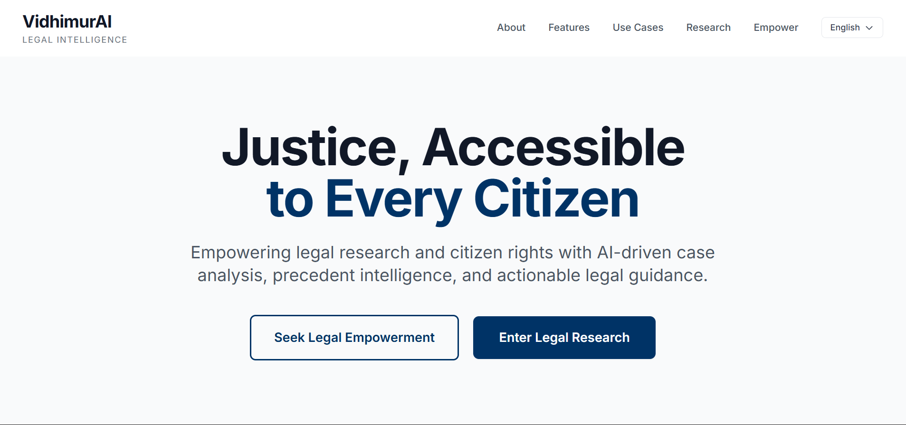
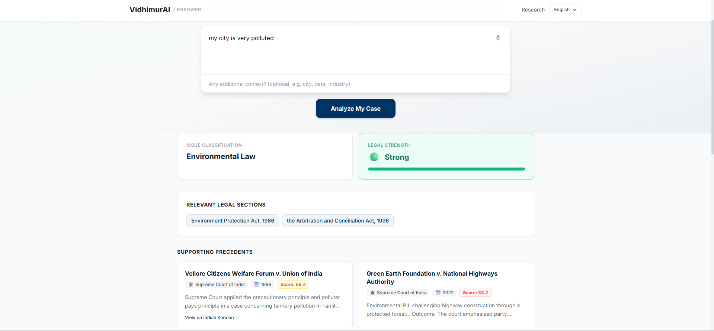
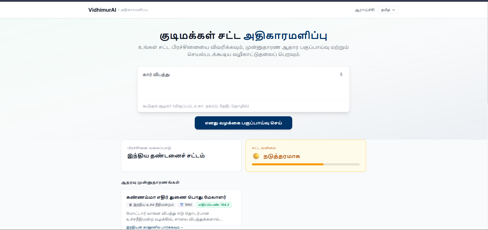
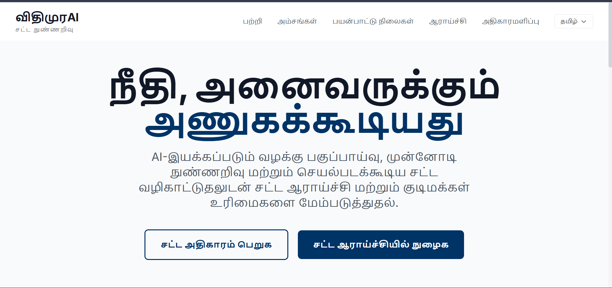

# VidhimurAI — Legal Intelligence Platform

## Demo

▶️ **[Watch the Full Demo on YouTube](https://youtube.com/YOUR_VIDEO_LINK_HERE)**

## Screenshots

| Landing Page | EMPOWER Analysis |
|:---:|:---:|
|  |  |

| Legal Strategy Timeline | Multilingual Translation |
|:---:|:---:|
|  |  |

> **Note**: Place your screenshots in the `images/` folder as `img1.png`, `img2.png`, `img3.png`, and `img4.png`.

## Problem Statement

Access to legal guidance in India remains a privilege. Over 70% of citizens lack awareness of their legal rights, applicable statutes, and procedural options when facing disputes. Language barriers, legal jargon, and the high cost of legal consultation create a systemic gap between ordinary citizens and the justice system.

For common disputes — consumer complaints, tenancy issues, property conflicts — most individuals either give up or act without understanding their legal position, often leading to unfavorable outcomes.

## Our Solution

VidhimurAI is a modular legal intelligence system that transforms a plain-language description of a legal issue into a structured, actionable legal package. The system operates as a multi-stage pipeline:

1. **Structured Analysis** — Classifies the legal issue, identifies applicable statutes, retrieves relevant case precedents, and assesses legal strength.
2. **Draft Generation** — Produces a formal legal complaint draft citing the identified laws and precedents.
3. **Simplification** — Rewrites the legal draft in plain language for citizen understanding.
4. **Translation** — Translates the draft into regional Indian languages (13 languages supported).
5. **Research Enhancement** — Provides AI-generated case summaries and influence analysis.
6. **Legal Roadmap** — Generates a complete procedural action plan covering evidence, notices, litigation, costs, and escalation.

The entire pipeline runs from a single user input and produces court-ready documentation.

## Target Users

| User Group | How VidhimurAI Helps |
|------------|---------------------|
| **Citizens** | Understand legal rights in plain language, get a ready-to-file complaint draft, and know the exact steps to take — without hiring a lawyer for initial guidance. |
| **Law Students** | Study how statutes apply to real-world scenarios, analyze case precedent scoring, and understand procedural roadmaps across legal domains. |
| **Legal Researchers** | Quickly retrieve and rank relevant case law using dual-mode scoring (authority + relevance), with AI-generated case summaries and influence analysis. |
| **Paralegals & Legal Aid Workers** | Generate first-draft complaints and action plans for clients in underserved communities, reducing time per case from hours to minutes. |
| **NGOs & Legal Clinics** | Provide multilingual legal guidance (13 Indian languages) to non-English-speaking populations, bridging the access-to-justice gap. |

## How VidhimurAI Compares to Existing Solutions

| Feature | Indian Kanoon | Manupatra | SCC Online | CaseMine | Vakilsearch | **VidhimurAI** |
|---------|:---:|:---:|:---:|:---:|:---:|:---:|
| Case Search | ✅ | ✅ | ✅ | ✅ | ❌ | ✅ |
| Plain-Language Input | ❌ | ❌ | ❌ | ❌ | ✅ | ✅ |
| Issue Classification | ❌ | ❌ | ❌ | ❌ | ❌ | ✅ |
| Auto Draft Generation | ❌ | ❌ | ❌ | ❌ | Templates only | ✅ (AI-generated, case-specific) |
| Simplified Explanation | ❌ | ❌ | ❌ | ❌ | ❌ | ✅ |
| Multilingual Support | ❌ | ❌ | ❌ | ❌ | ❌ | ✅ (13 languages) |
| Procedural Roadmap | ❌ | ❌ | ❌ | ❌ | Basic guides | ✅ (9-section AI roadmap) |
| Legal Strategy Timeline | ❌ | ❌ | ❌ | ❌ | ❌ | ✅ |
| Legal Strength Assessment | ❌ | ❌ | ❌ | ❌ | ❌ | ✅ |
| Relevance-Gated Scoring | ❌ | ❌ | ❌ | ✅ (CiteMap) | ❌ | ✅ |
| Free & Open Source | ✅ | ❌ (Paid) | ❌ (Paid) | Freemium | ❌ (Paid) | ✅ |
| Target User | Lawyers | Lawyers | Lawyers | Lawyers | Businesses | **Citizens first** |

### What Makes VidhimurAI Different

1. **Citizen-first, not lawyer-first** — Existing platforms assume legal training. VidhimurAI accepts plain-language input like *"my landlord won't return my deposit"* and produces actionable output.
2. **End-to-end pipeline** — No other platform combines case retrieval → draft generation → simplification → translation → roadmap in a single workflow.
3. **Multilingual by design** — 13 Indian languages supported, making legal guidance accessible to non-English speakers across India.
4. **Transparent scoring** — Every case result shows exactly why it was ranked (authority score, relevance score, court weight, citation impact) — no black-box algorithms.
5. **Free and open source** — Unlike Manupatra (₹15,000+/year) or SCC Online (₹12,000+/year), VidhimurAI is completely free.

## System Architecture

```
                          +-------------------+
                          |   User Input      |
                          |  (Natural Language)|
                          +--------+----------+
                                   |
                                   v
                     +-------------+-------------+
                     |  Query Normalizer          |
                     |  (Stopwords, Synonyms,     |
                     |   Domain Detection)         |
                     +-------------+-------------+
                                   |
                     +-------------+-------------+
                     |  EMPOWER Engine             |
                     |  Issue Classification       |
                     |  Case Retrieval + Ranking   |
                     |  Relevance Filtering        |
                     |  Statute Collection         |
                     |  Legal Strength Assessment  |
                     +--+---------+---------+-----+
                        |         |         |
              +---------+    +----+----+    +--------+
              v              v         v             v
     +--------+--+   +------+---+ +---+------+ +----+--------+
     | Draft      |   | Simplify | | Translate| | Research    |
     | Generator  |   |          | |          | | Enhancer    |
     +--------+---+   +------+---+ +---+------+ +----+--------+
              |              |         |              |
               +---------+----+---------+----+---------+
                        |
                        v
               +--------+--------+
               | Roadmap         |
               | Generator       |
               +--------+--------+
                        |
                        v
               +--------+--------+
               | Timeline        |
               | Visualization   |
               +--------+--------+
                        |
                        v
               +--------+--------+
               | Structured JSON |
               | Output          |
               +-----------------+
```

### Module Responsibilities

| Module | Role |
|--------|------|
| **EMPOWER Engine** | Core analysis pipeline: normalizes queries, classifies legal issues (with precise sub-categories), retrieves cases from local dataset, applies relevance-gated scoring, filters irrelevant cases, collects statutes, and assesses legal strength. |
| **Ranking Service** | Dual-mode scoring engine. Uses log-scaled citation scoring and relevance-gated authority to prevent irrelevant landmark cases from dominating. |
| **Query Normalizer** | Expands legal synonyms, removes stopwords, detects the legal domain from keywords. |
| **Kanoon Adapter** | Loads and parses the local JSON case dataset into typed `CaseRecord` objects. |
| **DraftGenerator** | LLM-powered service that generates a structured legal complaint draft from EMPOWER output. |
| **Simplifier** | LLM-powered service that rewrites complex legal text into plain citizen-friendly language. |
| **Translator** | LLM-powered service that translates legal drafts into regional Indian languages. |
| **ResearchAIEnhancer** | LLM-powered service that generates concise case holdings and influence analysis. |
| **RoadmapGenerator** | LLM-powered service that produces a 9-section procedural action plan. |
| **LLMService** | Abstraction layer over Groq API with JSON validation, markdown cleanup, and error recovery. |
| **Cache** | In-memory query cache to avoid redundant computation. |

### Why Modular

Each service operates independently with a clean input/output contract defined via Pydantic schemas. This allows:
- Independent testing and debugging of each pipeline stage
- Swapping LLM providers without changing business logic
- Parallel development across team members
- Clear API contracts for frontend integration

## Technical Stack

### Backend

| Component | Technology |
|-----------|-----------|
| Framework | FastAPI 0.115 |
| Validation | Pydantic 2.9 |
| Server | Uvicorn |
| Language | Python 3.11+ |
| LLM Provider | Groq Cloud |
| Model | LLaMA 3.3 70B Versatile |

### Frontend

| Component | Technology |
|-----------|-----------|
| Framework | React 18 |
| Language | TypeScript |
| Build Tool | Vite 6 |
| Styling | Tailwind CSS 3 |
| Internationalization | Custom i18n (13 Indian languages) |

### AI Layer

- **Prompt Engineering**: Each service uses role-specific system prompts with strict JSON output enforcement
- **Temperature**: Set to 0.2 for deterministic, reproducible outputs
- **JSON Validation**: Multi-pass validation with markdown stripping, regex extraction, and escape repair
- **Relevance Filtering**: Deterministic keyword matching combined with threshold-based case exclusion
- **Scoring**: Relevance-gated authority scoring prevents citation-heavy but irrelevant cases from dominating results

### Architecture Pattern

- **Hybrid Design**: Deterministic filtering (keyword matching, threshold gating, blacklists) combined with LLM reasoning (drafts, summaries, roadmaps)
- **Service-Based**: Each pipeline stage is an independent, testable module
- **Strict Contracts**: Pydantic models enforce request/response schemas across all API endpoints

## Core Features

### 1. Structured Legal Analysis (EMPOWER)

Classifies a citizen's issue into a precise legal category (e.g., "Security Deposit Recovery" rather than generic "Property Law"), identifies applicable statutes, retrieves factually similar case precedents, and assesses legal strength as Strong, Moderate, or Weak based on court hierarchy of matched cases.

### 2. Complaint Draft Generation

Generates a formal legal complaint with structured sections: Introduction, Statement of Facts, Legal Grounds (citing identified statutes), Relief Sought, and signature placeholder. The draft is ready for legal review and filing.

### 3. Simplified Explanation

Rewrites the legal draft in plain language using bullet points and simple vocabulary. Designed for citizens who need to understand their legal position without legal training.

### 4. Multilingual Translation

Translates legal drafts into 13 Indian languages: Hindi, Tamil, Telugu, Kannada, Malayalam, Bengali, Marathi, Gujarati, Punjabi, Odia, Assamese, and Urdu. Uses the LLM to preserve legal meaning while translating.

### 5. Research Enhancement

Provides AI-generated concise case holdings and influence analysis for each precedent. Explains why specific cases are legally significant based on citation count, court level, and recency.

### 6. Procedural Legal Roadmap (LLM-Powered)

Generates a complete 9-section action strategy using the LLM, constrained to the specific legal domain and statutes identified in the analysis. The roadmap generator enforces strict domain boundaries — a Consumer Protection issue will never suggest Motor Vehicles Act remedies. Each bullet is action-verb-first and capped at 12 words for clarity.

Sections covered:
- Immediate actions (0-7 days)
- Evidence checklist
- Legal notice strategy
- Pre-litigation options (mediation, Lok Adalat)
- Litigation strategy (forum, suit type, relief)
- Estimated timeline
- Cost considerations
- Risk assessment
- Escalation path (appeal options, alternate forums)

### 7. Legal Strategy Timeline (Visual)

An interactive, phase-based visual timeline displayed on the frontend that breaks the legal roadmap into distinct stages with progress indicators. Each stage (Immediate Actions → Evidence Collection → Legal Notice → Pre-litigation → Litigation → Escalation) is presented as a collapsible card with:
- Phase-specific icons and color coding
- Issue type badge and legal strength indicator (Strong/Moderate/Weak)
- Actionable bullet points per phase
- Estimated timeline and cost summary

### 8. Intelligent Query Enhancement (LLM Fallback)

When deterministic keyword matching fails to classify a legal domain (returns "General Legal Issue"), the system automatically invokes the LLM as a fallback to:
- Classify the legal domain from context
- Suggest additional search terms for better case retrieval
- Expand the query with domain-specific legal vocabulary

This ensures that even unconventional or colloquial descriptions of legal problems (e.g., *"my city is very polluted"* → Environmental Law) are correctly classified.

## Example Workflow

**Input:**
> "I bought a mobile phone and product malfunctioned before warranty period"

**System Output:**

1. **Structured Analysis**: Classifies as "Consumer Protection", identifies Consumer Protection Act 2019, retrieves factually similar defective product cases from Consumer Forums, assesses legal strength.

2. **Draft**: Generates a formal complaint titled "Defective Product Complaint Under Consumer Protection Act, 2019" with facts, legal grounds, and relief sought.

3. **Simplified Summary**: Plain-language explanation that a product failed within warranty and the consumer can seek replacement or refund.

4. **Translation**: Hindi translation preserving legal terminology and structure.

5. **Research Insights**: Case analysis showing relevant consumer forum precedent and its influence.

6. **Roadmap**: Step-by-step plan — send written complaint to manufacturer, gather bills and warranties, file with District Consumer Forum, estimated 3-6 months timeline, escalation to State and National Consumer Commission.

## How to Run the Project

### Prerequisites

- Python 3.11+
- Node.js 18+
- Git
- A Groq API key ([console.groq.com](https://console.groq.com))

### 1. Clone the Repository

```bash
git clone https://github.com/Sariga-2005/VidhimurAI.git
cd VidhimurAI
```

### 2. Configure Environment Variables

Create a `.env` file in the **project root** (`VidhimurAI/`):

```bash
GROQ_API_KEY=your_groq_api_key_here
```

> Replace `your_groq_api_key_here` with your actual key from [console.groq.com](https://console.groq.com).

### 3. Backend Setup

```bash
# Navigate to the backend directory
cd backend

# Create and activate a virtual environment
python -m venv venv

# Activate (Windows PowerShell)
.\venv\Scripts\Activate

# Activate (macOS / Linux)
# source venv/bin/activate

# Install all dependencies
pip install -r requirements.txt

# Start the backend server
python -m uvicorn app.main:app --port 8000
```

> **Note**: The backend must be started from inside the `backend/` directory. Use `python -m uvicorn` to avoid PATH issues. Add `--reload` for auto-restart during development.

### 4. Frontend Setup

Open a **separate terminal**:

```bash
cd frontend
npm install
npm run dev
```

### 5. Access the Application

| Service | URL |
|---------|-----|
| Frontend | [http://localhost:5173](http://localhost:5173) |
| Backend API | [http://localhost:8000](http://localhost:8000) |
| API Docs (Swagger) | [http://localhost:8000/docs](http://localhost:8000/docs) |

> Both the backend and frontend must be running simultaneously for the application to work.

### Quick Reference Commands

```bash
# Activate virtual environment (run from backend/ directory)
# Windows PowerShell:
.\venv\Scripts\Activate
# macOS / Linux:
source venv/bin/activate

# Deactivate virtual environment (when done)
deactivate

# Start backend (from backend/ directory, with venv activated)
python -m uvicorn app.main:app --port 8000

# Start backend with auto-reload (development)
python -m uvicorn app.main:app --port 8000 --reload

# Start frontend (from frontend/ directory)
npm run dev
```

## Project Structure

```
VidhimurAI/
├── .env                              # Environment variables (GROQ_API_KEY)
├── backend/
│   ├── requirements.txt              # Python dependencies
│   ├── generate_tags.py              # Auto-tagging utility
│   ├── app/
│   │   ├── main.py                   # FastAPI application entry point
│   │   ├── config.py                 # Scoring weights, legal synonyms, roadmap templates
│   │   ├── models/
│   │   │   └── schemas.py            # Pydantic request/response schemas
│   │   ├── routers/
│   │   │   ├── ai.py                 # /ai/* endpoints (draft, simplify, translate, roadmap, enhance)
│   │   │   ├── empower.py            # /empower/* endpoints
│   │   │   └── research.py           # /research/* endpoints
│   │   ├── services/
│   │   │   ├── empower.py            # EMPOWER analysis pipeline
│   │   │   ├── ranking.py            # Dual-mode case scoring engine
│   │   │   ├── query_normalizer.py   # Query expansion and domain detection
│   │   │   ├── kanoon_adapter.py     # JSON dataset loader
│   │   │   ├── search.py             # Research search logic
│   │   │   ├── cache.py              # In-memory query cache
│   │   │   └── auto_tagger.py        # Case auto-tagging
│   │   ├── data/
│   │   │   ├── cases.json            # Primary case dataset
│   │   │   ├── kanoon_cases.json     # Extended case dataset
│   │   │   ├── kanoon_raw.json       # Raw case data
│   │   │   └── vidhimur_tags.json    # Auto-generated case tags
│   │   └── errors/
│   │       └── handlers.py           # Global error handlers
│   └── services/
│       ├── llm_service.py            # Groq LLM abstraction layer
│       ├── draft_generator.py        # Legal complaint draft generator
│       ├── simplifier.py             # Plain-language simplifier
│       ├── translator.py             # Multilingual translator
│       ├── research_ai_enhancer.py   # AI case analysis enhancer
│       └── roadmap_generator.py      # Procedural action roadmap generator
└── frontend/
    ├── package.json
    ├── vite.config.ts
    ├── tailwind.config.js
    └── src/
        ├── App.tsx                   # Root application component
        ├── main.tsx                  # Application entry point
        ├── pages/
        │   ├── LandingPage.tsx       # Home page
        │   ├── EmpowerPage.tsx       # Citizen empowerment interface
        │   └── ResearchPage.tsx      # Legal research interface
        ├── components/
        │   ├── landing/              # Landing page components
        │   ├── layout/               # Layout components
        │   └── ui/                   # Reusable UI components
        ├── services/
        │   └── api.ts                # Backend API client
        └── i18n/
            ├── LanguageContext.tsx    # Language state management
            ├── useTranslation.ts     # Translation hook
            └── translations/         # 13 language JSON files
```

## Design Decisions and Engineering Choices

### Strict JSON Validation

LLMs occasionally return malformed JSON (markdown wrappers, unescaped characters, trailing text). The `LLMService` implements a multi-pass repair pipeline: markdown stripping, regex extraction, escape character repair, and destructive fallback. This ensures pipeline stages never crash due to LLM output inconsistency.

### Low Temperature (0.2)

Legal text generation requires consistency and factual accuracy. A low temperature reduces creative hallucination and produces reproducible outputs across identical inputs.

### Deterministic + LLM Hybrid

Issue classification, case filtering, statute blacklisting, and legal strength assessment use deterministic logic (keyword matching, thresholds, court hierarchy rules). Only content generation (drafts, summaries, translations, roadmaps) uses LLM reasoning. This ensures legal accuracy is not dependent on model behavior.

### Relevance-Gated Scoring

The ranking formula `Relevance + (Authority * Relevance / 100)` ensures that a case must be factually relevant before its authority (citations, court level) contributes to its score. This prevents famous but irrelevant landmark cases from appearing in results.

### Modular Service Separation

Each LLM-powered service (DraftGenerator, Simplifier, Translator, etc.) is a standalone class with its own system prompt and validation logic. This allows independent testing, prompt iteration, and potential parallelization without cross-service dependencies.

## Limitations

- **Not a legal substitute**: This system provides guidance, not legal advice. Output should be reviewed by a qualified advocate before filing.
- **Model dependency**: Output quality depends on the LLM (LLaMA 3.3 70B). Responses may vary and are not guaranteed to be legally accurate.
- **Dataset scope**: The system currently uses a **dummy dataset** formatted to match the output structure of the [Indian Kanoon API](https://api.indiankanoon.org/). Since the dataset is small and not sourced from real-time API calls, the results may not be fully accurate or comprehensive. Once integrated with the live Indian Kanoon API, retrieval quality and coverage will improve significantly.
- **Jurisdiction**: The system is designed for Indian law. Statute references and procedural guidance may not apply to other jurisdictions.
- **No OCR or document upload**: The current system only accepts text input, not scanned documents or images.

## Future Improvements

- **Embedding-Based Retrieval**: Replace keyword matching with vector embeddings for semantic case similarity.
- **Jurisdiction Detection**: Automatically detect the user's state and apply jurisdiction-specific rent control acts, consumer forum procedures, etc.
- **Document Upload**: Support PDF and image upload with OCR for extracting case details from existing documents.
- **Court Filing Automation**: Generate court-specific filing formats and calculate jurisdiction-appropriate court fees.
- **User Accounts**: Save case history, track case progress, and manage multiple disputes.
- **Expanded Dataset**: Integrate with Indian Kanoon API for real-time access to a comprehensive case law database.

## Team

| Role | Name | Reg No |
|------|------|--------|
| Member 1 | Harshita R | CB.SC.U4CSE23028 |
| Member 2 | Isha Sri Prakash | CB.SC.U4CSE23029 |
| Member 3 | Sarigasini M | CB.SC.U4CSE23065 |


